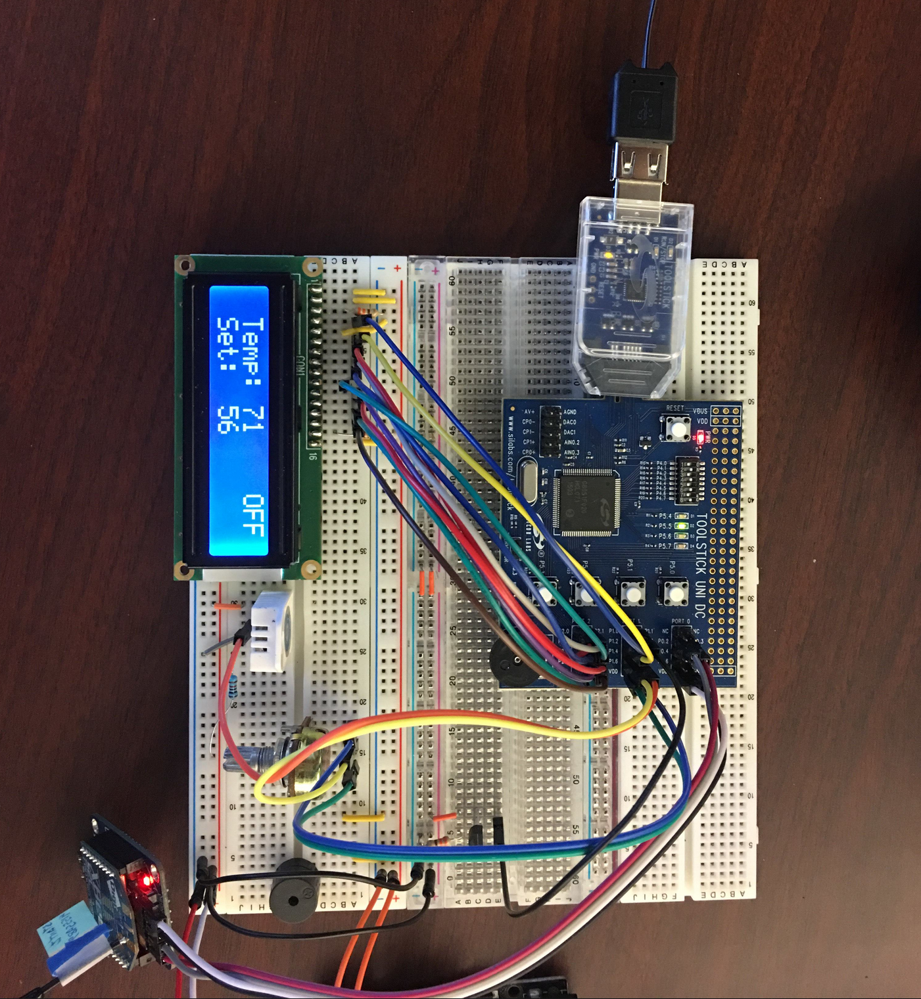

# Air Conditioner and Thermostat

This repo contains the code for an air conditioner and control unit, both of which are implemented on separate [Intel 8051](https://en.wikipedia.org/wiki/MCS-51) microcontrollers. The 8051 is also known as the MCS-51 and has a 12 MHz CPU.

Authored for a 2017 embedded systems course for an MS Software Engineering degree program. Group project by three students.

The thermostat and control unit communicate with each other ZigBee wireless networking. An LCD display outputs the temperature, set point, and whether the unit is on or off.

An image of the thermostat is below.

You can see the ZigBee radio on the bottom left of the image above. The potentiometer that controls the set point is right to the upper right of the ZigBee radio in the image.

The actual "air conditioner" was a separate unit and received the set point from the thermostat over the ZigBee wireless protocol, and also sent back the status of the unit (i.e. whether it was on or off) also over ZigBee wireless. 

To simulate an air conditioner, the team built a fan that was connected to a styrofoam box full of dry ice. Wiring the air conditioner control unit to an actual air conditioner was too time-consuming to complete by the project deadline. The effect, however, was the same: The temperature in the room would go down when the fan turned on and would shut off when the temperature reached the set point.

Due to dry ice emitting high levels of CO2, the team used CO2 sensors when testing this project for safety reasons.

The ZigBee communications for this project used a pre-shared symmetric encryption key that was programmed into each radio before activation, which was to prevent snooping and interception of the signals.

## Thermostat Unit

The thermostat samples temperature from an analog TMP36 and sends those bytes
over a ZigBee mesh network to the A/C controller 8051. The A/C controller averges those temperatures and then transmits both its state and the average temperature back to the thermostat. The thermostat displays the air conditioner's status (on or off), whether the A/C is out of coolant, and the average temperature calculated by the air conditioner.

The thermostat has a potentiometer (dial) that allows the user to set the desired room temperature. Both the TMP36 and potentiometer are wired to use ADC1 on the 8051. This requires using the ADC1 multiplex selector to choose the appropriate AN1 input pin. We use a timer to interrupt at a set interval to check the ADC1 value, and toggle between the two ADC1 inputs using the ADC1 multiplex selector register.

An LCD display unit is the primary output device for the user. It is a 16x2 display unit. It shows the average temperature as reported by the air conditioner, the system state, and the user's desired room temperature. The user's desired room temperature is updated immediately upon their adjusting the potentiometer. The average value is sent over the ZigBee network every few seconds and so changes less frequently.

An XBee S2C radio is connected to the thermostat via UART. See the code comments in the 8051-air-conditioner project and the associated .PDF on 8051-to-XBee interfacing for more details on that subject.

The team wished to include a buzzer that "buzzed" when a "no coolant"
message was received over ZigBee. Technically this was a simple addon
but numerous voltage output problems with both 8051 boards prevented it
and a time constraint on the due date made us hesitant to rush it in 
at the last minute. Our code to output signals to the buzzer are commented.

With more time and effort, we believe it would have been possible to use 
remote ZigBee sensor nodes to sample CO, gas, smoke, and other environmental
factors, transmit these to the thermostat, and then use a button on the
thermostat to toggle the LCD between different 'views' (temp, humidity,
CO, smoke, etc). Time ran out, however.

## Air Conditioner Unit

For the A/C unit, also implemented using an 8051 microcontroller, the "set" value is the temperature the user wishes the room to remain at. This value is received from an XBee ZigBee S2C device via UART1. The actual room temperature is also received from the XBee ZigBee S2C device, but in this case, the incoming values can be from a mesh of potentially many remote XBees. 

The A/C unit computes an average of all the remote sensor readings and determines whether, based on the difference between the set and actual values, if the A/C fan needs to turn on or off.

The idea behind having a "running average" from many remote XBee devices is that no one "spike" or sudden drop in input will itself cause a reaction from the A/C unit. These spikes and drops will instead be smoothed out.

Additionally, the A/C unit has its own temperature sensor that exists inside the unit and is used to determine when the coolant (in our case, this is either ice or dry ice) is empty. For example, if the *internal* temp of the cooler is above, say, 70F, then it's likely there is no more ice and hence no point in running the fan. This also triggers an alert for the user in the form of an audible buzz from a buzzer and an LED is turned on for a visual indication that replenishment is needed.