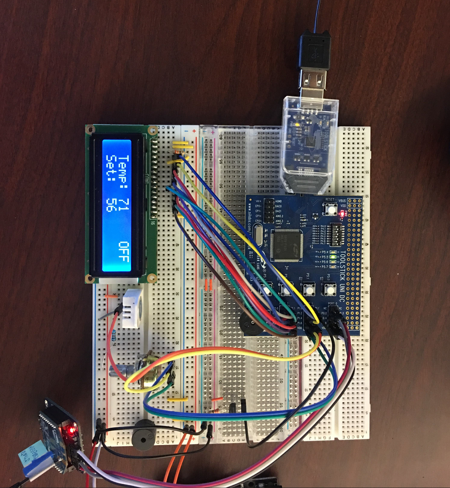
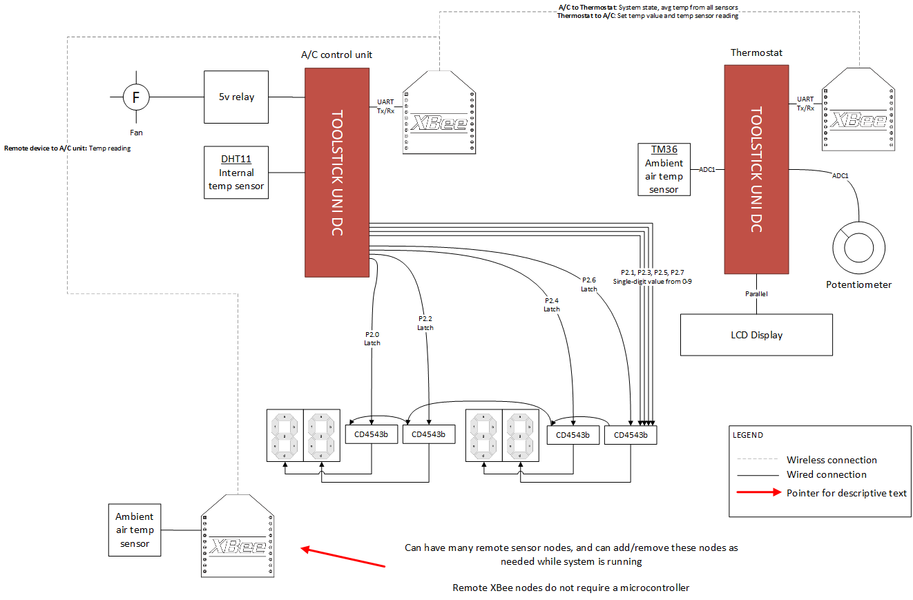
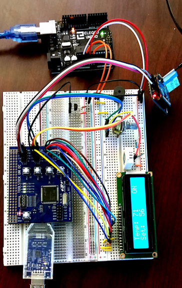
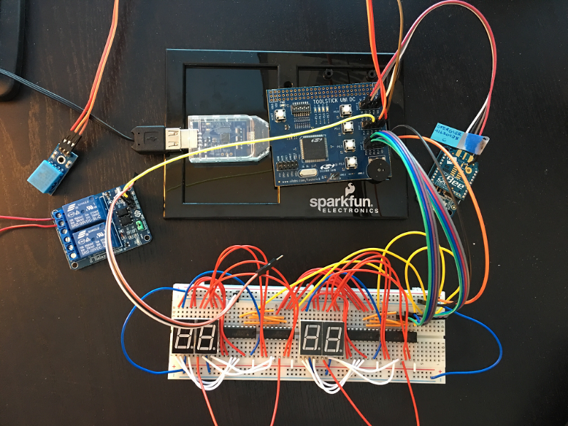
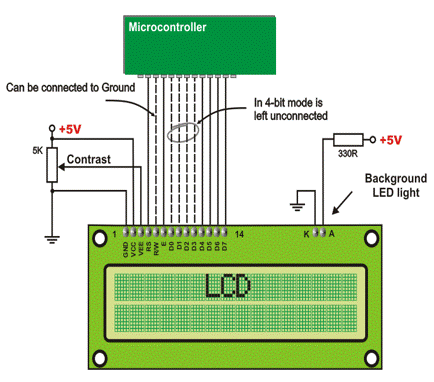
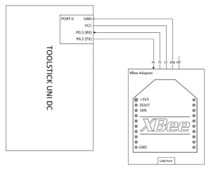

# Air Conditioner and Thermostat

This repo contains the code for an air conditioner and control unit, both of which are implemented on separate [Intel 8051](https://en.wikipedia.org/wiki/MCS-51) microcontrollers. The 8051 is also known as the MCS-51 and has a 12 MHz CPU.

Authored for a 2017 embedded systems course for an MS Software Engineering degree program. Group project by three students.

The thermostat and control unit communicate with each other ZigBee wireless networking. An LCD display outputs the temperature, set point, and whether the unit is on or off.

An image of the thermostat is below.

You can see the ZigBee radio on the bottom left of the image above. The potentiometer that controls the set point is right to the upper right of the ZigBee radio in the image.

The actual "air conditioner" was a separate unit and received the set point from the thermostat over the ZigBee wireless protocol, and also sent back the status of the unit (i.e. whether it was on or off) also over ZigBee wireless. 

To simulate an air conditioner, the team built a fan that was connected to a styrofoam box full of dry ice. Wiring the air conditioner control unit to an actual air conditioner was too time-consuming to complete by the project deadline. The effect, however, was the same: The temperature in the room would go down when the fan turned on and would shut off when the temperature reached the set point.

Due to dry ice emitting high levels of CO2, the team used CO2 sensors when testing this project for safety reasons.

The ZigBee communications for this project used a pre-shared symmetric encryption key that was programmed into each radio before activation, which was to prevent snooping and interception of the signals.

## Thermostat Unit

The thermostat samples temperature from an analog TMP36 and sends those bytes over a ZigBee mesh network to the A/C controller 8051. The A/C controller averges those temperatures and then transmits both its state and the average temperature back to the thermostat. The thermostat displays the air conditioner's status (on or off), whether the A/C is out of coolant, and the average temperature calculated by the air conditioner.

The thermostat has a potentiometer (dial) that allows the user to set the desired room temperature. Both the TMP36 and potentiometer are wired to use `ADC1` on the 8051. This requires using the ADC1 multiplex selector to choose the appropriate AN1 input pin. We use a timer to interrupt at a set interval to check the ADC1 value, and toggle between the two ADC1 inputs using the ADC1 multiplex selector register.

An LCD display unit is the primary output device for the user. It is a 16x2 display unit. It shows the average temperature as reported by the air conditioner, the system state, and the user's desired room temperature. The user's desired room temperature is updated immediately upon their adjusting the potentiometer. The average value is sent over the ZigBee network every few seconds and so changes less frequently.

An XBee S2C radio is connected to the thermostat via UART. See the code comments in the 8051-air-conditioner project and the associated .PDF on 8051-to-XBee interfacing for more details on that subject.

The team wished to include a buzzer that "buzzed" when a "no coolant" message was received over ZigBee. Technically this was a simple addon
but numerous voltage output problems with both 8051 boards prevented it and a time constraint on the due date made us hesitant to rush it in at the last minute. Our code to output signals to the buzzer are commented.

With more time and effort, we believe it would have been possible to use remote ZigBee sensor nodes to sample CO, gas, smoke, and other environmental
factors, transmit these to the thermostat, and then use a button on the thermostat to toggle the LCD between different 'views' (temp, humidity, CO, smoke, etc). Time ran out, however.

## Air Conditioner Unit

For the A/C unit, also implemented using an 8051 microcontroller, the "set" value is the temperature the user wishes the room to remain at. This value is received from an XBee ZigBee S2C device via UART1. The actual room temperature is also received from the XBee ZigBee S2C device, but in this case, the incoming values can be from a mesh of potentially many remote XBees. 

The A/C unit computes an average of all the remote sensor readings and determines whether, based on the difference between the set and actual values, if the A/C fan needs to turn on or off.

The idea behind having a "running average" from many remote XBee devices is that no one "spike" or sudden drop in input will itself cause a reaction from the A/C unit. These spikes and drops will instead be smoothed out.

Additionally, the A/C unit has its own temperature sensor that exists inside the unit and is used to determine when the coolant (in our case, this is either ice or dry ice) is empty. For example, if the *internal* temp of the cooler is above, say, 70F, then it's likely there is no more ice and hence no point in running the fan. This also triggers an alert for the user in the form of an audible buzz from a buzzer and an LED is turned on for a visual indication that replenishment is needed.

## 8051-LCD Interface

This is a 16x2 LCD display with a blue backlight and runs in 8-bit mode. An HD44780 chip drives the display.

## 8051-XBee Interface

The ZigBee wireless feature of the overall system design is done using XBee radios. This was a challenging effort and took many hours.

The first issue was that `UART0` and P0.0 / P0.1 are dedicated to USB and this is not explicitly mentioned in the serial programming chapter in the 8051 book that was used as a reference throughout the project.

Pins 0.0 and 0.1 are not connected. The default UART crossbar configuration sets up `UART0` on P0.0 and P0.1 despite their not being connected. This was a source of a lot of time expenditure with little to show.

Since we were unable to directly assign Tx/Rx pins, we had to configure the crossbar so UART runs on other ports. This was done by enabling both `UART0` and `UART1`. 

`UART0` was assigned the non-functional P0.0 and P0.1. `UART1` was assigned the next-highest priority pins, P0.2 and P0.3, which are connected. We then used `UART1` and just ignored `UART2`.

We used SiLabs example code to set the baud rate to 9600 and enabled UART interrupts. An interrupt occurs on each byte that comes over UART. When the interrupt occurs, we check the `SCON1` flag to see if it's a read or a write as the system can do both.

For reads, we read the byte from `SBUF1` and shove it into a global UART buffer (just an array of `char`s) and increment the buffer index.

A `while` loop in the main function checks to see if the UART buffer is non-zero. If true, the function next checks to see if it matches the ZigBee API frame spec.

Bytes are then easily retrieved from the buffer since the ZigBee API tells us exactly where to find data and metadata.

The buffer's 'start index' is reset to tzero so the next UART interrupt will overwrite the current buffer values.

The implementation used separate Tx and Rx buffers for the thermostat, but ran into artificial Keil code limit on the A/C unit due to licensing restrictions of the Keil IDE.

## A/C Control Unit Programming

A digital DHT11 temperature sensor was used for checking the coolant level. Since the system used ice or dry ice as the coolant, this sensor should read a low temperature while sufficient coolant exists; should coolant run out, a higher temperature would be read and the system would turn off.

This required implementing serial communications in software, specifically changing a pin from input to output and waiting 1 microsend between digital "reads" after the handshake.

The LEDs on the control board show the remaining coolant in 25% increments.

A 5v relay was used to control the fan. The fan pushed air across the coolant, cooling the air, and an exhaust port in the tank would ensure the cooled air entered the room.

UART was used for the XBee radios. The XBee S2C radio (digital) over UART received temperature readings from potentially many radios and would also receive the 'set' value from a remote thermostat unit. This radio would also transmit the average temperature from all remote XBee radios, the coolant status, and the fan state (on/off) to the thermostat unit so it could be displayed ot the user.

The team created a "display bus" using 4x CD4543B's to drive four 7-segment displays, consuming only 8 pins on the the 8051's port 2. The first two 7-segment displays display the "set" temperature and the the second two display the actual temperature. Note that as this was the control unit, in a real-world scenario these displays would not normally be seen by the user (think attic placement) so were not done using an LCD display.

In terms of receiving temperatures from many XBee radios on a PAN, we had to deal with very limited memory on the 8051. This meant we did not keep track of individual radios in memory and instead kept a running average of all received temperatures coming in over the UART interface, regardless of source. An average of the last 7 was used to protect the system against sudden spikes or drops i.e. smoothing the data out.

And this allowed for flexibility as we could add/remove radios from the ZigBee mesh. The A/C unit is therefore not hard-coded for any specific network addresses.

## Thermostat design - additional details

On the thermostat, unlike the A/C control unit, an analog temperature sensor was used - a TMP36. A potentiometer allows the user to change the 'set' point from 50F to 90F. 

The LCD display shows the set value, the average temperature in the room, the coolant level in the remote A/C unit, and whether the A/C unit's fan is on or off.

An XBee S2C radio (digital) was connected to the thermostat over UART. This radio receives the average temperature from the A/C control unit (not the swarm of XBee radios), the fan state, and the coolant level. It also transmits the 'set value' taken by the potentiometer and the temp reading from the analog temperature sensor.

## Challenges

1. The first challenge was that were zero examples of how to interface XBee radios with an 8051. Even UART examples beyond reading chars from a terminal were hard to find. This required going back to the 8051 programming book and reading the specifications, i.e. going back to first principles. 

2. The book also said the 8051 UART output is +/-12v but was not true for the 8051 boards used in this design.

3. The next challenge was that the DHT11 digital temperature sensor needed precise timings down to 1 microsecond to implement serial communications.

4. Memory. ZigBee API frames can get large and we ran out of memory in some cases, and this required finding creative ways to reduce overall memory footprint.

5. Keil compiler, which has a limit to the size of code that can be written due to licensing or other reasons. One of our two 8051 boards ran into this artificial limit and prevented further feature development.

6. Impossible to debug UART interrupt code. As soon as you break on the interrupt, that's the last byte you're going to read!

7. Understanding the CD4543B and how to create a "bus" using latches was required so we could drive 4x 7-segment displays with just 8 GPIO pins.

8. 8051 power output was not good.

9. LCD codes for our LCD display were not readily available and took extensive research and investigation. We found `lcd.h` only after many hours of searching.

## Lessons Learned

1. The XBee adatper had Rx and Tx pins mislabeled. Many hours were wasted thinking the 8051 UART code was wrong when in fact it was coded fine.

2. `UART0` and pins 0.0 and 0.1 are dedicated to USB and unavailable on the TOOKSTICK UNI DC, and this is not obvious or documented. The crossbar has to be configured in a specific way to get around this and allow `UART1` on different pins.

3. Many hours were spent trying to get the LCD working and the team almost gave up on the LCD several times, when it turned out the LCD was working fine - it was the 8051's below-spec power output that was the problem!

4. We learned that we had to configure our analog pins _before_ connecting the TM36 or we would destroy the TM36. The team ended up with a TM36 graveyard.

5. Almost all 8051 examples the team came across had either (a) numerous mistakes or (b) were written for other boards and needed extensive modification to work with the TOOLSTICK UNI DC boards.

6. We were lucky to have gotten started on the project ahead of schedule so we had time to deal with these problems.

## References

* LCD Library: https://electrosome.com/interfacing-lcd-with-8051-using-keil-c-at89c51/

* TM36 data sheet used: http://cdn.sparkfun.com/datasheets/Sensors/Temp/TMP35_36_37.pdf

* ZigBee API frame specifications: https://www.sparkfun.com/datasheets/Wireless/Zigbee/XBee-Manual.pdf

* ZigBee API checksum: http://knowledge.digi.com/articles/Knowledge_Base_Article/Calculating-the-Checksum-of-an-API-Packet

